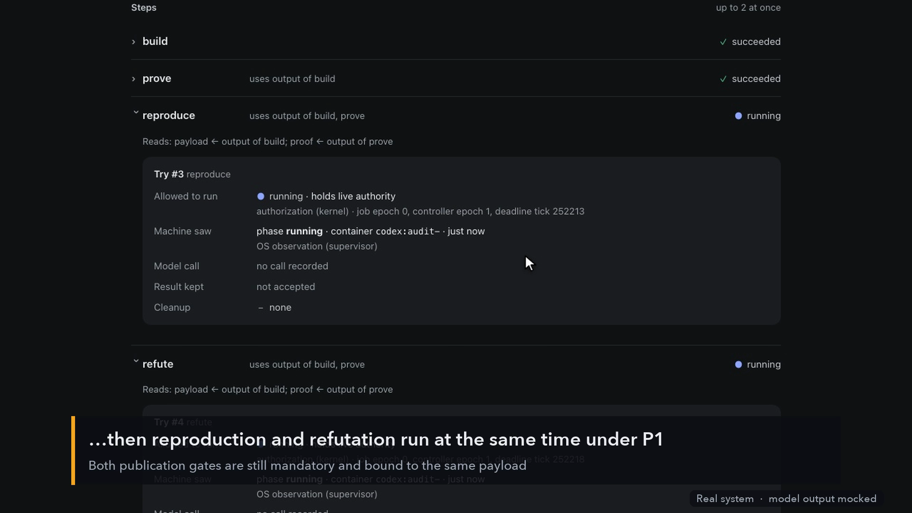

# Factory Workbench

A local, single-operator workbench that runs durable, reviewed jobs and changes **its own executable
orchestration packages** from inside the product. A proposed change brings its implementation,
machine-checked proof obligations, tests, review evidence and a disposition for existing jobs. The
running release builds and evaluates its successor; a small protected control plane (a Lean 4 kernel
on the real admission path, a fixed verifier, and human approval) admits releases. The candidate
cannot authorize itself.

[](docs/video/factory-workbench-demo.mp4)

*[Watch the 2:34 operator walkthrough](docs/video/factory-workbench-demo.mp4): sign in, run a job,
ask the workbench to improve itself, review the evidence, approve and activate.*

> **Status: research prototype.** Model inference is **mocked by default** (a deterministic fake Codex
> CLI, clearly labelled everywhere); live Codex mode is currently blocked by a CLI limitation (see
> [`OPEN-ITEMS.md`](OPEN-ITEMS.md)). The Lean kernel, SQLite journal, sandboxed builds, proof replay
> and release gates are real. [`ASSURANCE.md`](ASSURANCE.md) says exactly what is proved, checked,
> tested and assumed; [`DEMO-RESULTS.md`](DEMO-RESULTS.md) records what was actually executed.

This repository implements [`docs/SPEC.md`](docs/SPEC.md) (the build contract; the original brief is
[`docs/BUILD_PROMPT.md`](docs/BUILD_PROMPT.md)).

## Quick start

Needs Docker, Node.js 25, and [elan](https://github.com/leanprover/elan) (details under
[Requirements](#requirements)). All commands run from the repository folder.

```bash
npm ci && npm run build:web
```

```bash
./scripts/build-images.sh
```

```bash
node apps/control/cli.ts doctor
```

```bash
node apps/control/cli.ts bootstrap
```

```bash
node apps/control/cli.ts serve
```

`serve` prints a one-time sign-in link; open it in your browser. From there:

1. **Run an audit** (Home → *Run an audit*): watch a job build, prove and review a package. Every
   try shows separately whether it was allowed to run, what the machine saw, the model call, the
   result kept, and cleanup.
2. **Improve the workbench**: type a request in the box on Home (e.g. *"Let the reproduce and refute
   reviews run at the same time. Both must still pass."*) and press *Start*. The improvement page
   shows each draft, the checker's real diagnostics, and what the change does in plain words.
3. **Review, approve, activate**: when a release is published, *Needs you* on Home links to it. The
   release page leads with the decision: the exact release, per-fact evidence, and the effect on
   existing jobs. Approve and activate are separate steps, each confirmed by typing the release's
   first 8 characters.
4. **Existing jobs stay put**: jobs keep the release they started with. To move a paused job, open
   it and use *Move to another release* (preview first, then apply).
5. **Roll back**: open an earlier release under *Releases* and approve + activate it again.

Signed out (for example after restarting the server, which ends sessions)? Run
`node apps/control/cli.ts login` for a fresh link. Everything in the UI is also available from the CLI:
`node apps/control/cli.ts --help`. Run `npm link` once if you'd like a `workbench` command on your PATH
(the docs use `workbench <command>` and `node apps/control/cli.ts <command>` interchangeably).

## What is where

| Path | Role | Candidate-editable? |
|---|---|---|
| `protected/lean/Factory/` | Lean kernel: types, workflow checks, transition function `apply`, migration, codec, executable wrapper, contracts (K01–K12), proofs | no |
| `protected/verifier/` | fixed verifier: materializer, lint, statement bridge, sandboxed build/prove/tests, receipts | no |
| `protected/runner-profiles/images/` | pinned container images (Lean toolchain + prebuilt protected library + harness) | no |
| `protected/contracts.json` | property IDs, theorem names, frozen package statements | no |
| `protected/tests/` | acceptance tests A01–A30, fault/mutation fixtures, fake-Codex fixtures | no |
| `apps/control/` | coordinator (single writer), engine/supervisor, API (Fastify), CLI, demo | no |
| `apps/web/` | operator UI (React/Vite) | no |
| `packages/codex-adapter/` | the only LLM path: Codex CLI adapter + clearly-labeled deterministic fake | no |
| `packages/store`, `packages/runner`, `packages/protocol` | SQLite/blob store, container primitives, canonical JSON | no |
| `orchestration/genesis/` | genesis orchestration package P0 (workflows, planner, proofs, prompts) | **this kind of package is what self-improvement changes** |

Runtime state lives outside the tree: `$FACTORY_STATE_DIR` (default `~/.factory-workbench/state`):
`workbench.sqlite`, `blobs/sha256/..`, `releases/<release_digest>/`, `attempts/`, `staging/`,
`operator/` (0700: operator token, runner-owned `codex-home`), `kernel/factory-kernel` (installed,
digest-pinned).

## Requirements

- macOS or Linux host with Docker (Linux containers; tested with Docker Desktop 29.8 on macOS arm64)
- Node.js ≥ 25 (runs `.ts` directly via type stripping; tested 25.8.1)
- elan with `leanprover/lean4:v4.34.1` for the host kernel build (`~/.elan/bin/lake`)
- Optional: Codex CLI (`codex-cli 0.155.1` observed) for live inference — see "Authentication boundary"

Exact versions and image IDs: [`toolchains.lock.json`](toolchains.lock.json), [`TOOLCHAIN.md`](TOOLCHAIN.md).

## Setup

```bash
npm ci
```

```bash
npm run build:web
```

```bash
./scripts/build-images.sh
```

```bash
node apps/control/cli.ts doctor
```

```bash
node apps/control/cli.ts bootstrap
```

`bootstrap` is the human-authorized trust root: it builds the protected Lean kernel, installs it
(digest recorded), verifies the genesis package with the fixed verifier inside the sandbox (build,
statement bridge, axiom audit, `leanchecker --fresh` replay, protected tests), writes the genesis
bundle, and commits the `bootstrap` command through the kernel. It prints the operator token path.

## Run

```bash
node apps/control/cli.ts serve
```

`serve` prints a **one-time sign-in link** (`http://127.0.0.1:4317/#login=…`) when run in a terminal;
open it and you're in (if its output is redirected, it prints the `login` command to run instead).
The nonce is not the operator token: it travels only in the URL fragment (never sent to the server or
logged), the page strips it from history and POSTs it once for an HttpOnly session cookie, and it
expires after 5 minutes. `node apps/control/cli.ts login` prints a fresh link; pasting the token from
`<state>/operator/token` still works as a fallback. The server binds to loopback only, requires the
token/session for every API call, validates Host/Origin, and requires a CSRF header on writes. UI
design notes: [`docs/design/UI-REDESIGN.md`](docs/design/UI-REDESIGN.md).

CLI equivalents (the server must be running):

```bash
node apps/control/cli.ts job submit --fixture genesis-package
```

```bash
node apps/control/cli.ts change propose "Parallelize the independent reproduction and refutation reviews ..."
```

```bash
node apps/control/cli.ts release approve <release> --expected-base <active>
```

```bash
node apps/control/cli.ts release activate <release> --expected-active <active> --approval <approval-id>
```

```bash
node apps/control/cli.ts migrate preview <job> --target <release>
```

Also: `job show|list|fixtures|pause|resume|cancel`, `change list|show|revise`,
`release list|show|preview|revoke`, `migrate apply`, `journal verify|export`, `recovery pause-all`.
Release arguments accept a full digest or a unique prefix (at least 6 hex characters). Use `--state DIR`
and `--port N` to run more than one instance.

## Demonstration

```bash
node apps/control/cli.ts demo --fake-llm
```

Runs the founding demonstration (§0/§19.1) end to end on a fresh state directory with the workbench
as a child process: P0 audit job with a real SIGKILL mid-proof and recovery; P0 authors/evaluates P1
(the first candidate has a real proof error, repaired through a recorded revision); activation
preview, approval, activation; explicit checked migration of a paused P0 job; a running P0 job stays
pinned; P1 authors/evaluates P2 with a general equivalence proof; refutation-removal and protected-file
bypass attempts are rejected; planner benchmark; journal replay. **Inference is mocked** by a
deterministic fake Codex CLI (every event and artifact carries `fake: true`); the kernel, SQLite,
containers, Lean compilation, proof replay and release gates are real. Evidence:
`docs/demo-evidence.json`.

`demo --live-codex --consent --budget N` runs `doctor` first and refuses (no substitute) while the
installed CLI cannot enforce the required tool profile — see OPEN-ITEMS.

## Check everything

```bash
./scripts/check-all
```

Typecheck, kernel build, kernel proof audit + `leanchecker --fresh` replay (`docs/proof-status.json`),
doctor, UI build, unit tests, acceptance tests A01–A30, the fake-LLM demo, and the ledger
`docs/test-results.json`. It exits non-zero on any failed or missing required check. Live inference
is reported as `not_run`. It takes 30–60 minutes and rewrites the tracked evidence files
(`docs/test-results.json`, `docs/proof-status.json`, `docs/demo-evidence.json`, `DEMO-RESULTS.md`).
For a quick loop see [`CONTRIBUTING.md`](CONTRIBUTING.md).

## Authentication boundary

- The **operator token** (`<state>/operator/token`, 0600) authenticates the UI/CLI. It is never placed
  in candidate context, prompts, SSE URLs or containers.
- **Codex credentials** belong only in the runner-owned `CODEX_HOME` (`<state>/operator/codex-home`),
  provisioned by the operator (e.g. `CODEX_HOME=<state>/operator/codex-home codex login`). The
  workbench writes the security profile `config.toml` there and never reads `auth.json`. Build,
  proof, test and planner containers receive no credentials and no network. Caveat: in live mode the
  Codex process itself runs on the host (Codex's `read-only` sandbox, empty workspace, minimal env),
  not in a container, and any `codex.env` entries in settings are passed to it; see
  [`OPEN-ITEMS.md`](OPEN-ITEMS.md) §2.
- Only two API routes answer without a session: `POST /api/session/claim` (redeems a one-time link)
  and `GET /api/signin-hint` (tells the sign-in page which `login` command to show and where the
  token file is, including its absolute path). Both are loopback-only and Host-checked.
- Kernel-level actors (`operator`, `coordinator`, `supervisor`, `verifier`) are attached by the
  coordinator; model output can never choose its actor, role, subject, lease or verifier identity.

## End-to-end example (what happens on "Improve this workbench")

1. `create_change` binds the request to the active base release and a shared attempt/revision budget.
2. An **author** job (pinned to the base) calls Codex with the base package source, the frozen
   contracts and allowed paths as data; the trusted **materializer** applies exact-preimage edits to a
   fresh snapshot → frozen candidate `source_digest`.
3. `register_candidate` creates an **evaluation** job pinned to the base release: fixed sandboxed
   **build** → fixed **prove** (trusted statement bridge + axiom audit + `leanchecker --fresh` +
   kernel-checked binary/definition binding) → **reproduce** (protected tests executed by the
   workbench + model interpretation) and **refute** (fresh context, no peer judgment) → summary.
4. A trusted build/proof failure triggers a bounded, recorded repair revision with the real
   diagnostics; a failed or inconclusive review stops the change.
5. The kernel's `publish_release` admits the release only with passing, payload-bound, contract-bound
   evidence for build/prove/reproduce/refute. The operator approves the exact release digest against
   the expected base, then activates it (compare-and-swap). Existing jobs stay pinned unless an
   explicit, checked, revision-bound migration is applied to a paused job.

## License

[MIT](LICENSE).
